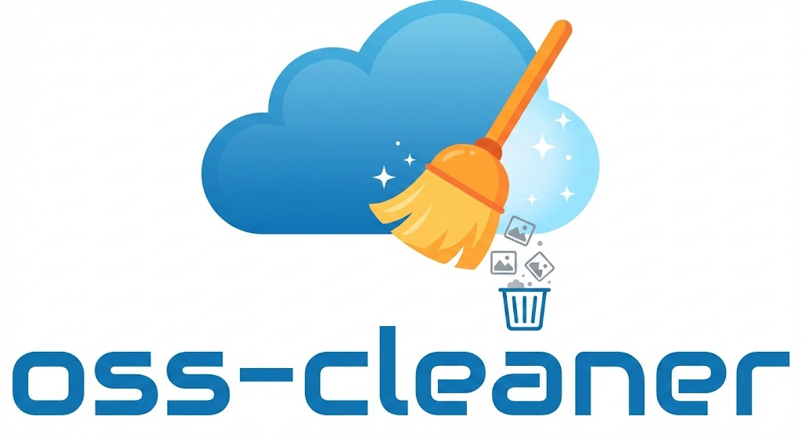

<div align="center">



<br>

[](https://pypi.org/project/oss-cleaner/)
[](https://pypi.org/project/oss-cleaner/)
[](https://github.com/LinJHS/oss-cleaner/actions)
[](https://pypi.org/project/oss-cleaner/)
[](https://github.com/LinJHS/oss-cleaner/blob/main/LICENSE)

**一个用于管理和清理阿里云 OSS 中“无用”图片的工具，专为 Markdown 笔记用户设计。**

[English Version](README_EN.md) | [功能特性](#-主要功能) • [安装](#-安装与运行) • [使用](#-快速开始-pip-安装方式)

</div>

它会扫描你本地的 Markdown 文件夹，分析所有引用的图片链接，并与阿里云 OSS 存储桶中的文件进行比对。任何未在本地 Markdown 文件中使用的 OSS 图片都将被标记为“无用”文件，你可以通过 Web 界面轻松查看并批量删除它们，从而节省存储空间和费用。

## ✨ 主要功能

*   **智能扫描**：自动递归扫描指定目录下的所有 `.md` 文件。
*   **精准比对**：提取 Markdown 中的 OSS 图片链接，与云端数据进行比对。
*   **可视化管理**：提供直观的 Web 界面展示孤儿图片列表。
*   **批量清理**：支持一键批量删除未使用的图片。
*   **便捷配置**：支持通过 Web 界面或文件夹选择器轻松配置路径。

## 📦 安装与运行

### 方式一：下载可执行文件（推荐）

无需安装 Python 环境，直接下载对应系统的可执行文件运行即可。

1.  前往 [Releases 页面](https://github.com/LinJHS/oss-cleaner/releases) 下载最新版本：
    *   **Windows**: 下载 `oss-cleaner-win.exe`
    *   **macOS**: 下载 `oss-cleaner-mac`
    *   **Linux**: 下载 `oss-cleaner-linux`
2.  **运行程序**：
    *   **Windows**: 双击 `oss-cleaner-win.exe` 即可。
    *   **macOS/Linux**: 在终端赋予执行权限后运行：
        ```bash
        chmod +x oss-cleaner-mac  # 或 oss-cleaner-linux
        ./oss-cleaner-mac
        ```
    *   程序启动后会自动打开浏览器访问 [http://localhost:6900](http://localhost:6900)。

### 方式二：使用 pip 安装

如果你熟悉 Python，也可以使用 `pip` 安装：

```bash
pip install oss-cleaner
```

或者从源码安装（开发模式）：

```bash
git clone https://github.com/LinJHS/oss-cleaner.git
cd oss-cleaner
pip install -e .
```

## 🚀 快速开始 (pip 安装方式)

1.  **启动服务**

    安装完成后，在终端运行以下命令启动 Web 服务（默认会自动打开浏览器）：

    ```bash
    python -m oss_cleaner
    ```

    **命令行参数：**

    *   `--port <port>`: 指定运行端口 (默认: 6900)
    *   `--no-browser`: 禁止自动打开浏览器
    *   `--debug`: 开启调试模式

    例如：
    ```bash
    python -m oss_cleaner --port 8080 --no-browser
    ```

2.  **访问界面**

    打开浏览器访问 [http://localhost:6900](http://localhost:6900)。

3.  **配置参数**

    首次运行时，你需要配置以下信息（可以通过界面上的配置按钮进行设置）：
    *   **OSS Domain**: 你的 OSS 自定义域名或默认域名 (例如 `oss-cn-hangzhou.aliyuncs.com`)。
    *   **Prefix**: 图片存储的前缀目录 (例如 `images/`)。
    *   **Access Key ID & Secret**: 阿里云访问密钥。
    *   **Endpoint**: OSS 区域节点 (例如 `oss-cn-hangzhou.aliyuncs.com`)。
    *   **Bucket Name**: 存储桶名称。
    *   **Markdown Path**: 本地 Markdown 笔记的根目录。

4.  **清理图片**

    配置完成后，刷新首页，系统将列出所有未引用的图片。勾选你想要删除的图片，点击“删除”按钮即可。

## ⚙️ 配置说明

配置文件默认存储在用户目录下的 `.config/oss-cleaner/settings.json` (Linux/macOS) 或 `AppData/Roaming/oss-cleaner/settings.json` (Windows)。

## 📄 许可证

本项目采用 GPL-3.0 许可证。详情请参阅 [LICENSE](LICENSE) 文件。
